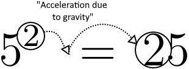

# Squaring-numbers-due-to-gravity
The idea of squaring numbers due to gravity came from a trick I was taught in elementary school.

This trick, albeit helpful for the less arithmetically inclined, is a terrible way to remember how to square 5. This proof explains why 5 is the only number that this applies to.
